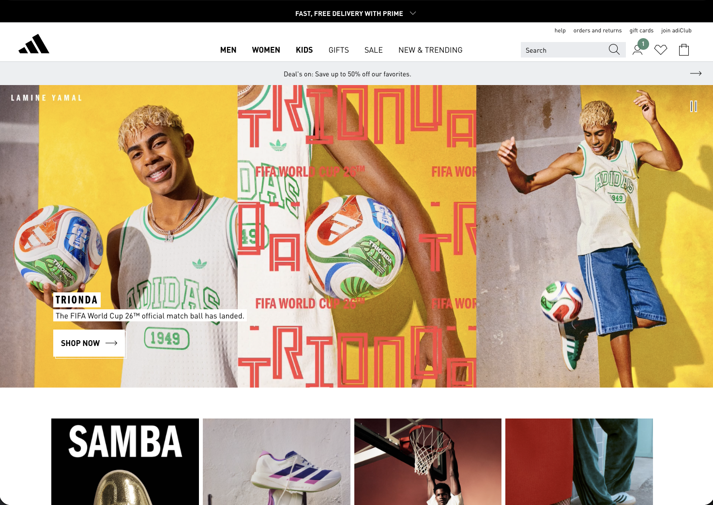

# Competitor Analysis: Adidas

## Basic Information

**Company Name:** Adidas AG
**Website URL:** https://www.adidas.com  
**Business Category:** Athletic Footwear & Apparel, Sports Performance Equipment
**Primary Target Audience:** Athletes, fitness enthusiasts, casual sports wear consumers aged 13-45, both male and female

---

## Brand Archetype Analysis

### Identified Archetype: Hero

**Evidence for this archetype:**
- "Through Sport We Have The Power To Change Lives" tagline inspires achievement and overcoming challenges
- Sponsorship of elite athletes and Olympic teams positions them as champions
- Performance-focused messaging emphasizes winning, strength, and pushing limits

### Visual Identity

**Color Palette:**
- Primary colors: Black, White, and Gray (classic, powerful, professional)
- How colors support the archetype: The stark black and white contrast creates a bold, confident, no-nonsense feel that embodies the Hero archetype's strength and determination

**Typography:**
- Font styles: Modern, geometric sans-serif typeface (clean and contemporary)
- How fonts support the archetype: The angular, strong letterforms communicate power and precision, aligning with athletic performance and achievement

**Imagery Style:**
- Type of photos/graphics: High-quality action shots of athletes performing at peak moments, product close-ups showing technical details
- Mood and feeling: Energetic, inspirational, motivational – images capture moments of triumph and athletic excellence
- How imagery supports the archetype: The hero imagery literally shows people as heroes conquering challenges and achieving greatness through sport

### Brand Voice and Messaging

**Tone of Voice:**
- Direct, motivational, and action-oriented. Adidas speaks with confidence and inspires customers to take action. The tone is professional yet accessible, celebratory of athletic achievement without being pretentious.

**Key Messages/Headlines:**
- "Impossible is Nothing" - Their classic tagline emphasizing limitless potential
- "Challenge Everything" - Messaging that encourages pushing boundaries and questioning limits
- "Designed to Move" - Product-focused messaging highlighting performance and functionality

**How messaging supports the archetype:**
Their words directly align with the Hero archetype by using empowering language that positions customers as achievers who can overcome any obstacle. The messaging doesn't talk about "trying" – it talks about "doing," "winning," and "conquering."

---

## Persuasion Techniques Analysis
### 1. Reciprocity
**Do they use it?**  Yes

**If yes, how:**
- Free fitness apps and training guides available on their website and through partnerships with fitness platforms
- VIP membership program that provides exclusive access to new products, early sales, and member-only events
- Educational content about sports science, training techniques, and athlete profiles
- Very effective: Customers feel valued and invested in the brand, increasing loyalty and repeat purchases

### 2. Scarcity  
**Do they use it?**Yes

**If yes, how:**
- Limited edition collaborations with famous athletes and designers (e.g., exclusive Messi collections)
- Flash sales and time-limited promotions prominently featured on homepage ("Limited Time Offer")
- Seasonal releases and numbered limited editions create urgency
- Highly effective: Creates urgency and drives immediate purchasing decisions, especially among collectors and enthusiasts

### 3. Authority
**Do they use it?** Yes

**If yes, how:**
- Extensive athlete partnerships and sponsorships (Messi, James Harden, Serena Williams, Olympic teams)
- Featured testimonials from professional athletes and fitness influencers
- Third-party certifications for sustainability and ethical manufacturing
- Highly effective: Customers trust the brand more when they see world-class athletes endorsing it

### 4. Consistency
**Do they use it?** Yes

**If yes, how:**
- Consistent visual branding across all channels (same color scheme, typography, athlete imagery)
- Repeated messaging around "Challenge Everything" and performance excellence
- Brand guidelines reflected in product design and marketing materials
- Very effective: The consistency reinforces the Hero archetype across all touchpoints

### 5. Liking
**Do they use it?** Yes

**If yes, how:**
- Customization options for products (personalization with names/numbers)
- Community building through local sports events and partnerships
- Friendly, approachable tone in customer service and social media interactions
- Product design focuses on aesthetics alongside function, appealing to fashion-conscious consumers
- Highly effective: Makes the brand feel more personal and accessible despite being a global corporation

### 6. Social Proof
**Do they use it?** Yes

**If yes, how:**
- Customer reviews and ratings prominently displayed on product pages
- "Bestseller" and "Customer Favorite" badges highlight popular items
- Social media feed integration showing customer photos wearing Adidas products
- Celebrity and influencer partnerships showcase public endorsement
- Very effective: Shows that millions of customers trust and prefer Adidas

### Most Effective Persuasion Technique
**Which principle do they use best?** Authority and Social Proof combined. The heavy use of elite athlete partnerships combined with customer reviews and social media integration creates a powerful "everyone who matters loves Adidas" narrative. This is incredibly effective for a performance brand where credibility and peer validation drive purchasing decisions.

---

## Sales Funnel Analysis

### Stage 1: Awareness
**How they attract attention:**

**Homepage Hero Section:**
- Headline: "Impossible is Nothing" / Current seasonal campaign headline featuring hero athletes
- Visual: Large-format video or image of elite athletes in action, performing at peak moments with dynamic motion
- Value proposition: Adidas positions itself as the performance partner for athletes who refuse to accept limits

**First Impression:**
- A first-time visitor immediately understands this is about athletic performance and achievement
- The hero imagery dominates the fold, creating an emotional impact within 2-3 seconds
- Navigation is intuitive with clear categories (Shoes, Apparel, Sports, Collections) allowing quick orientation

### Stage 2: Interest  
**How they build curiosity:**

**Information Architecture:**
- Navigation: Well-organized menu with categories for Men, Women, Kids, Shoes, Apparel, Sports, Collections, and Sustainability
- Content organization: Products grouped by sport (Running, Basketball, Football/Soccer, Tennis, etc.) and lifestyle (Casual, Fashion, Performance)

**Engagement Techniques:**
- Interactive product filters allow users to search by sport, size, color, and technology features
- Educational content about shoe technology (Boost, Ultraboost, CloudFoam) explained with technical details and comparisons
- Video demonstrations showing athletes using products in real scenarios
- Athlete spotlights and training tips keep users exploring and learning

### Stage 3: Desire
**How they create emotional connection:**

**Trust Building:**
- Testimonials: Extensive customer reviews on product pages with ratings, photos, and verified purchase badges
- Credentials: Awards for innovation (Red Dot Design Awards), sustainability certifications, partnerships with Olympic committees
- Guarantees: 30-day return policy clearly displayed, free shipping on orders above certain amount, quality warranty on products

**Value Communication:**
- Product pages include comparison tools showing technology advantages over competitors
- Benefit-focused descriptions explain not just what the product is, but how it improves athletic performance
- Emotional appeals connect products to aspirations: "Run Faster," "Jump Higher," "Dominate the Court"

### Stage 4: Action
**How they drive conversion:**

**Call-to-Action (CTA):**
- Primary CTA text: "Add to Bag" / "Buy Now"
- CTA placement: Positioned prominently on product pages with size/color selection; sticky header keeps it visible while scrolling
- Button design: Bold color (typically black or brand-specific color), large size, high contrast ensuring visibility

**Conversion Process:**
- Streamlined checkout process with guest checkout option (no forced account creation)
- Multiple payment options (credit cards, PayPal, digital wallets) accommodate diverse customer preferences
- Security badges and SSL certificate clearly visible at checkout building confidence
- Recommended products and complementary items shown before final purchase, subtly encouraging larger basket sizes

### Complete Customer Journey Assessment
**Overall funnel effectiveness:** 9/10 - Adidas has optimized each stage to move customers smoothly from awareness to action with minimal friction.

**Strongest stage:** Awareness and Authority/Social Proof: The brand recognition combined with athlete endorsements creates powerful initial attraction and trust

**Weakest stage:** Arguably Stage 2-3 transition: while they excel at building desire, some users report information overload with too many product options and collections

---

## Competitive Strengths

### What They Do Really Well
1. **Elite Athlete Partnerships & Endorsements:** Adidas has secured exclusive deals with some of the world's greatest athletes (Lionel Messi, James Harden, Serena Williams). This creates unmatched credibility and aspirational appeal. Their athletes are literally winning championships in Adidas gear, providing continuous earned media and proof of performance.

2. **Innovation in Performance Technology:** Continuous R&D has produced industry-leading technologies like Boost cushioning, Ultraboost systems, and Primeknit fabrics. These aren't just marketing claims – they're recognized by athletes and competitors alike. The company backs claims with technical data and real athlete testing, creating legitimate differentiation.

3. **Consistent Visual Branding & Storytelling:** From the iconic Three Stripes logo to their color choices and imagery style, Adidas maintains a powerful, recognizable brand identity across all channels. Their marketing campaigns tell compelling narratives about human achievement and breaking limits.

### Why These Strengths Matter
These strengths help Adidas maintain premium pricing while competing globally. Customers are willing to pay more for Adidas because they trust the performance, aspire to the athlete lifestyle, and recognize the brand instantly. The consistent branding creates emotional connection that transcends price and functionality alone.

---

## Competitive Weaknesses  

### Areas for Improvement
1. **Product Catalog Complexity:** With hundreds of products across multiple sport categories, sub-lines, and collaborations, the website can feel overwhelming for casual shoppers. Finding exactly what you want requires either specific knowledge or extended browsing. This friction point may cause some shoppers to abandon before purchase.

2. **Premium Pricing Creates Accessibility Barrier:** Adidas products are positioned at the higher end of the market. While this supports the Hero/Premium brand image, it excludes price-sensitive customers and emerging markets where value alternatives like Puma and New Balance are gaining ground.

3. **Limited Personalization at Scale:** While customization exists, the options are relatively basic compared to emerging competitors. The website doesn't deeply personalize the shopping experience based on browsing history, sport type, or fit preferences—missing opportunity for increased conversion rates.

### Missed Opportunities
- Adidas could better leverage AI/recommendation engines to reduce product overwhelm and improve the interest-to-desire stage conversion
- Stronger sustainability messaging could appeal to conscious consumers; while mentioned, it's not as prominent in marketing as performance benefits
- Limited content around community building and user-generated content compared to some digitally-native competitors
- Fewer interactive elements (size finders, virtual try-on, style quizzes) that could increase engagement and reduce return rates

---

## Key Takeaways for Our Strategy

### What We Can Learn

**Archetype Lessons:**
- A strong, clearly-defined archetype (Hero) permeates every brand touchpoint, from messaging to imagery to partnership selection. We should identify our archetype early and use it as a North Star for all decisions
- The archetype should be reflected in who you partner with and which athletes/influencers you choose. Adidas doesn't partner with just anyone; they choose people who embody their Hero archetype

**Persuasion Lessons:**  
- Authority is not just about claims, it's about partnerships and third-party validation. Building relationships with respected figures in your industry creates credibility that advertising alone cannot
- Combining multiple persuasion principles (Authority + Social Proof + Scarcity) creates a more powerful effect than using any single technique
- Consistency across all touchpoints reinforces persuasion principles. Every channel should tell the same story

**Funnel Lessons:**
- The hero imagery in awareness stage captures emotion quickly, but the real conversion magic happens through reducing friction and building trust in stages 2-4
- Product recommendations and complementary item suggestions are subtle but powerful conversion tactics
- Clear, easy-to-find CTAs don't feel salesy – they feel like natural next steps in the customer journey

### What We Should Do Differently
Unlike Adidas's premium positioning, our business might benefit from a more accessible entry point. If Adidas has product complexity as a weakness, we could position ourselves as offering "The Right Product, Right Away" with simplified, curated selections. We could also emphasize community and user stories more heavily than Adidas does, creating emotional connection through relatable customer voices rather than just elite athletes.

### Specific Implementation Ideas
1. Develop a clear brand archetype and create a style guide ensuring every piece of content (image, video, copy) reinforces it
2. Identify 3-5 key industry influencers or partners who embody your archetype and build relationships with them (don't need to be celebrities, credible experts work great)
3. Create a recommendation system that learns from user behavior to reduce product overwhelm and guide customers toward ideal products for their needs

---

## Screenshots and Examples
**Homepage Screenshot Notes:**
The Adidas homepage features a large hero section (approximately 70% of the viewport) with a high-quality video or image of an elite athlete in motion. The hero image dominates the above-fold area, with only the main navigation and search visible. Below the fold is a grid of product categories with hero images for each (Running, Basketball, Football/Soccer, etc.), followed by limited-time offers, featured collections, and new releases.

**Key Page Examples:**
- **Product Pages**: Include large product images with zoom capability, multiple color/variant options shown as thumbnail grids, size guide with detailed measurements, customer review section with star ratings and photos, and related products sidebar
- **Category Pages**: Organized by filters on the left (Size, Price Range, Color, Technology features), with clear sorting options (Best Sellers, New, Price), and product cards showing image, name, original price, sale price (if applicable), and rating
- **Collection Pages**: Highlight collaborations or seasonal collections with storytelling elements – videos showing how the product was designed, interviews with athletes or designers, and limited-availability messaging

---

## Research Process Notes

**Pages Analyzed:**
- Homepage and main navigation structure
- Product category pages (Running, Basketball, Apparel)
- Individual product pages (including both bestsellers and new releases)
- Collection/Collaboration pages (special edition partnerships)
- Customer service and About pages (to understand guarantees and credentials)
- Mobile responsive experience across key pages

**Time Spent:** 15 minutes

**Analysis Method:** 
- Conducted live website navigation like a typical customer journey (discovery -> browsing -> consideration -> checkout flow)
- Took notes on design elements, messaging, CTAs, and persuasion techniques
- Compared product page layouts and checkout process
- Examined customer reviews and ratings to understand trust signals
- Researched brand history and athlete partnerships through their marketing materials and About page

---

## Sources and References

1. Adidas official website: https://www.adidas.com - Primary research source for website analysis, product pages, homepage, customer reviews, and brand messaging
2. Adidas brand partnerships and athlete sponsorships - verified through their main website and news section
3. Adidas sustainability and manufacturing certifications visible on their corporate responsibility pages
4. Customer reviews and testimonials from product pages
5. Analysis based on Cialdini's 6 Principles of Influence framework and AIDA sales funnel model as discussed in class

---